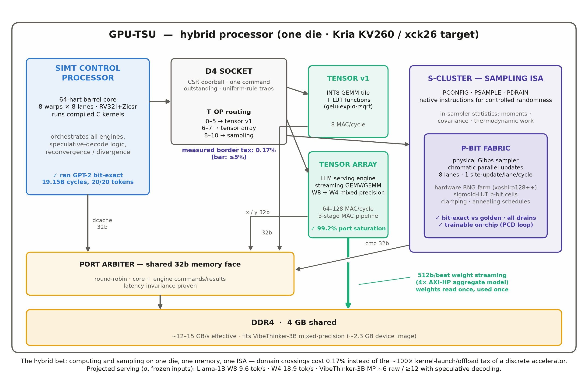

# GPU TSU Chip

GPU TSU Chip is a hybrid processor that places three compute domains behind
one ISA and one memory system:

- a 64-hart, 8-warp × 8-lane RV32I SIMT control processor;
- INT8 and mixed W8/W4 tensor engines;
- a binary and categorical stochastic sampling fabric.

The design is golden-first: synthesizable RTL is checked against independent,
bit-true Python models, and the integrated SoC is driven by compiled C kernels
through a small CUDA-shaped runtime. The first FPGA target is the AMD/Xilinx
Kria K26 (`xck26-sfvc784-2LV-c`).



## Documentation

- [Hardware Architecture](docs/HARDWARE_ARCHITECTURE.md) — SIMT, tensor,
  memory, sampling fabric, sampling ISA, and categorical q-sites.
- [FPGA Implementation](docs/FPGA_IMPLEMENTATION.md) — K26 profiles, timing,
  resources, SG0 bridge, and landed hardware optimizations.
- [Software and Validation](docs/SOFTWARE_AND_VALIDATION.md) — kernel ABI,
  CUDA-shaped runtime, serving path, GPT-2 validation, and test methodology.
- [30.9× Plans/Joule Evidence](docs/PLANS_PER_JOULE_30_9X.md) — auditable
  evidence record for the projected plans/joule headline, including its
  algorithm-class claim boundary.

These documents replace the original collection of small specification
and design-note files.

## Repository layout

```text
rtl/      synthesizable SystemVerilog and lookup-table images
golden/   bit-true and independent behavioral reference models
tb/       Cocotb and Verilator unit/integration testbenches
sw/       device runtime, linker scripts, and example/gate kernels
host/     compiler/runtime, simulator transport, and K26 UIO transport
sim/      timing-aware memory model
gates/    hardware certification and performance gates
ci/       lint, regression, Vivado OOC, profile, and bitstream flows
docs/     the three consolidated technical documents
```

Application-research code, checkpoints, experiment results, agent handoffs,
session logs, and project-management notes are intentionally not part of this
repository.

## Quick start

Python 3.11 or newer and Verilator 5.036 or newer are recommended.

```sh
python3 -m venv .venv
source .venv/bin/activate
python -m pip install -r requirements.txt
source env.sh
zsh ci/doctor.sh
zsh ci/lint.sh
zsh ci/run_units.sh
```

On Apple Silicon, `zsh ci/setup_macos.sh` can install the simulator, Python
environment, RISC-V toolchain, Spike, and optional synthesis/statistical tools.
Large external datasets and GPT-2 weights are not committed; the gates that
need them report their expected local paths.

## FPGA build

Vivado 2024.2 is the recorded implementation version. The scripts under
`ci/ooc/` cover per-module OOC timing, personality fits, and the SG0 K26
bitstream. Generated reports, checkpoints, and bitstreams are intentionally
ignored.

## Project status

The RTL, golden references, simulation runtime, K26 bridge, and Vivado build
flows are included. FPGA bitstreams are generated artifacts and are not stored
in Git. No software or hardware license is asserted because the source project
did not contain a license file.
